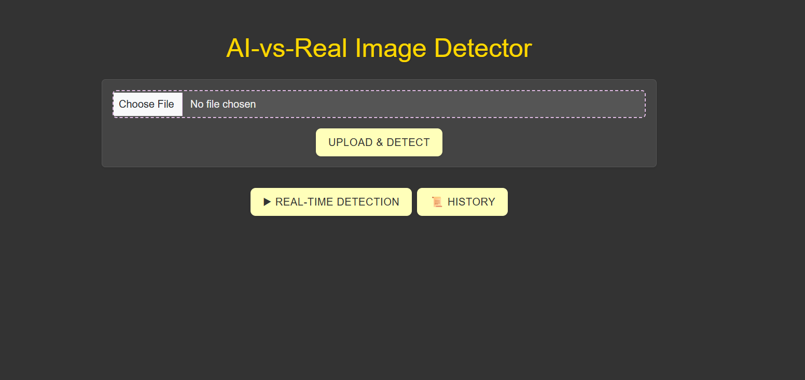
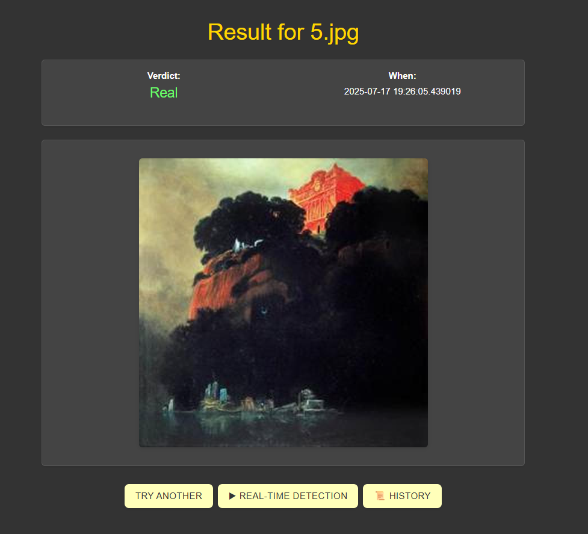
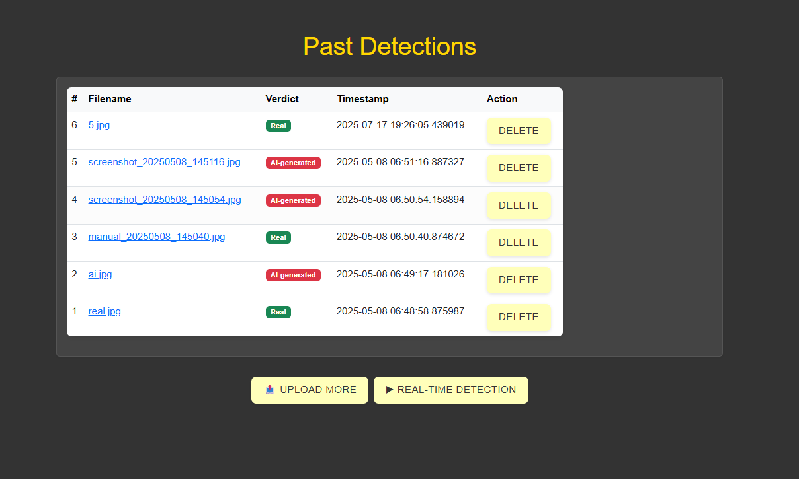
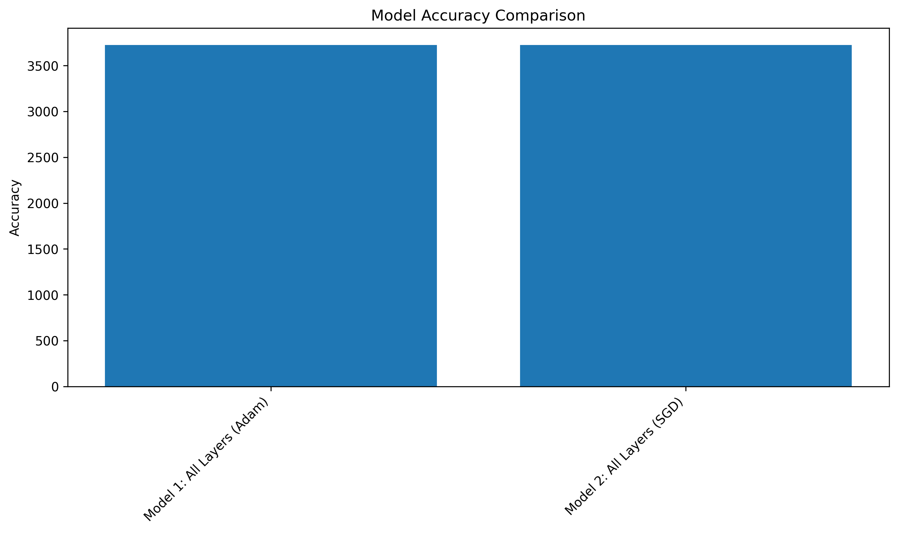
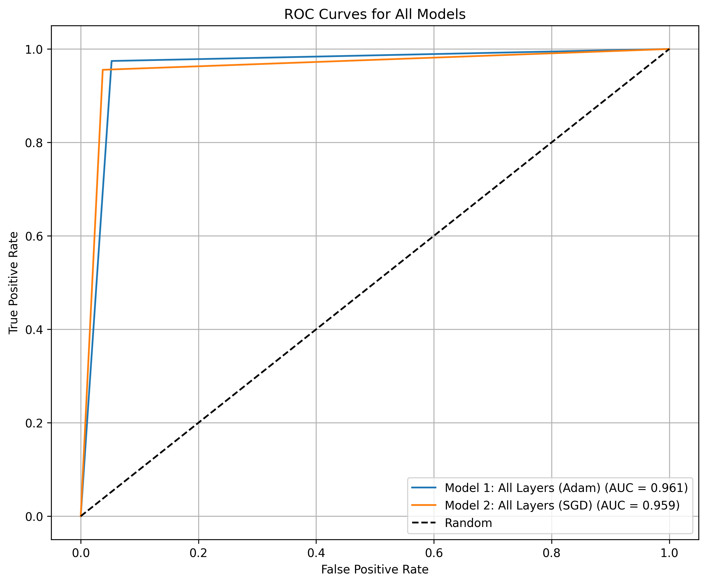

# AI-vs-Real-Image-Detector

An image detector AI that distinguishes between AI-generated and real images. Built with EfficientNet, fine-tuned on the ai_art_classification dataset, and deployed via a Flask web app with real-time webcam support.

---

## 🚀 Features
- **Upload or Webcam:** Detect if an image is AI-generated or real via file upload or real-time webcam.
- **History:** View past detection results.
- **Visual Results:** See detection verdicts and confidence scores.

---

## 🛠️ Requirements
Install the following Python packages (preferably in a virtual environment):

```bash
pip install flask flask_sqlalchemy torch torchvision ultralytics opencv-python pillow numpy
```

- Python 3.8+
- (Optional) CUDA-enabled GPU for faster inference

---

## 📦 Setup & Deployment

1. **Clone this repository**
2. **Download model weights**
   - Place `effbest_model_ai_detection.pth` and `paperDetection.pt` in `Dep(RealTime)/` (already included if you see them).
3. **Run the web app**
   ```bash
   cd Dep(RealTime)
   python app.py
   ```
   The app will be available at [http://localhost:3000](http://localhost:3000)
- 
- 
- 
---

## 🏋️‍♂️ Training the Model

Training is done in a Jupyter notebook:

1. Open `efficientNetTraining.ipynb` in Jupyter.
2. Follow the notebook to train EfficientNet on your dataset.
3. Save the resulting weights as `effbest_model_ai_detection.pth` in `Dep(RealTime)/`.

---

## 🖼️ Model Training Result

Below are some key result images from the project:

| Model Accuracy Comparison | ROC Curve | Training History |
|--------------------------|-----------|-----------------|
|  |  |  |


---

## 📂 Project Structure
```
Dep(RealTime)/
  app.py                # Flask app (main entrypoint)
  model.py              # Model architecture
  effbest_model_ai_detection.pth  # Trained EfficientNet weights
  paperDetection.pt     # YOLOv8 weights for paper detection
  predictions.db        # SQLite DB for history
  static/               # CSS and static files
  templates/            # HTML templates
images/                 # Project result images
```

---

## 👤 User Guide
- **Upload Tab:** Upload an image to check if it's AI-generated or real.
- **Real-time Tab:** Use your webcam for live detection.
- **History Tab:** Review previous detections and delete records if needed.

---

## 📢 Notes
- For best results, use clear images of printed or digital artwork.
- Webcam detection requires a working camera and may prompt for permissions.
- If you retrain the model, update `effbest_model_ai_detection.pth` accordingly.

---

## 📧 Contact
For questions or issues, please open an issue or contact the maintainer.
